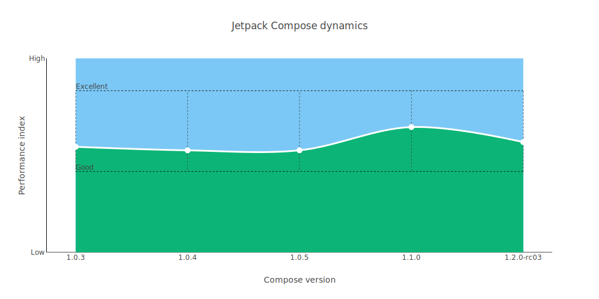

# [Jetpack Compose](https://developer.android.com/jetpack/compose) performance testing (🚧 WIP)

 

> ## 🛑 Disclaimer 
> This project is not official, and the information is provided "as-is".
All test cases described by the author are based only on his experience and knowledge of the technology at the moment ?and may not reflect the actual state of affairs. 
The information contained here can not be considered the only source of truth and serves solely as general information about Jetpack Compose's performance.
Make any conclusions only at your own discretion.

 

## About

The goal of this project is to benchmark various aspects of the UI framework.  It tries to cover as many scenarios as possible  — medium complexity list scrolling, animation, recomposition, custom layouts, canvas, etc.

The project uses the official [Macrobenchmark library](https://developer.android.com/studio/profile/macrobenchmark-intro?hl=en) to perform testing.

Devices used for testing: 
 - `Samsung Galaxy S10, Android 11; `
 - `Samsung Galaxy S21 (Exynos variant), Android 12;`
 - `Samsung Galaxy S21 Ultra (Exynos variant), Android 12;`
 - `OnePlus Nord N10, Android 11;`
 - `Pixel 2 XL, Android 11;`
 - ~~`Xiaomi Mi 6, Android 9.`~~ device died (×_×)

Tested Jetpack Compose versions: 
 - `1.0.3`
 - `1.0.4`
 - `1.0.5`
 - `1.1.0`

The project is continuously updating.

 

## Benchmarking

### Average performance graph for tested devices:
The `Good-Excellent` range is equivalent to the field of `60-120FPS`.

  

#### 
 *⚠️ this graph represents performance status based on project tests only ⚠️* 

 

All tests run with the same setup:
 - 2 runs, 2 warmups;
 - `WARM` startup wode;
 - `SpeedProfile` compilation mode;
 - Android Gradle Plugin 7.0.3;
 - R8 optimizations enabled.

## View all benchmarks summaries [HERE](android-client/benchmark/benchmark_reports/reports).

 

## How to run
 - clone the repository;
 - to run the tests only open the [TweetListBenchmark.kt](android-client/benchmark/src/main/java/com/sergey_y/benchmark/TweetListBenchmark.kt) and run as regular tests in your Android Studio;
 - to generate full report:
    - install externally [plotly-orca](https://github.com/plotly/orca) tool. The `orca` command must be available on the command line (added to the system environment);
    - open the terminal inside the root of the project(where benchmark.sh is located);
    - connect your android device, unlock the screen, execute the shell script and wait (about an hour, you may see errors in the log, keep calm and wait until it says “done” or stops running the command)
    - the reports should be located [here](android-client/benchmark/benchmark_reports/reports/) in a folder named according to your device model.
- to run a specific JP Compose version test and produce a report:
    - checkout to the desired `compose-x.x.x` branch;
    - open the terminal in the `android-client` directory and run the command `./gradlew: benchmark:go`(the orca is required too, see above), with your Android device connected before.
 
  

## FAQ
 - `what are these P50 and P90 on the charts?` — *these are percentiles. Read more in [Wikipedia](https://en.wikipedia.org/wiki/Percentile);*
 - `why only two(or any other number) runs/warmups?` — *running tests is a laborious operation; checking all versions of Compose on only one device takes about an hour, and during the development of this benchmark, I had to run it many times :) more iterations or warmups improved the accuracy by only a fraction of a percent for me;*
 - `can these charts be trusted?` — *1) view the source code; 2) read the disclaimer;*
 - `why does JP Compose is running slower on my device?` — *every Android device is unique, and something might not work as expected. Keep calm, always check the release build with R8 optimizations enabled and profile the code ... and do not forget to report bugs to [the official bug tracker](https://issuetracker.google.com/issues/new?component=612128&template=1253476).*

 

## TODO
 - refactor all the code;
 - make the tests run on multiple devices at the same time;
 - suggest.