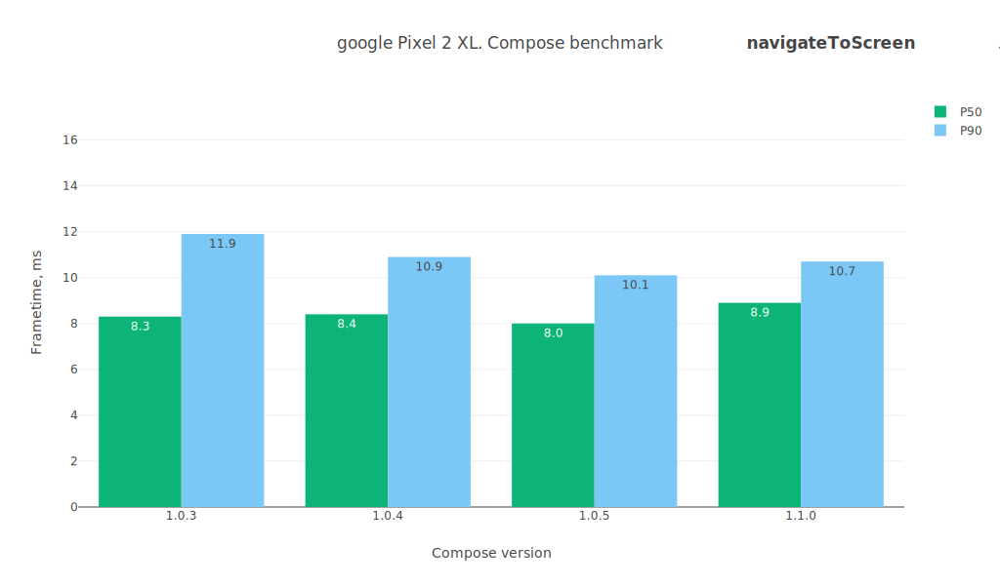
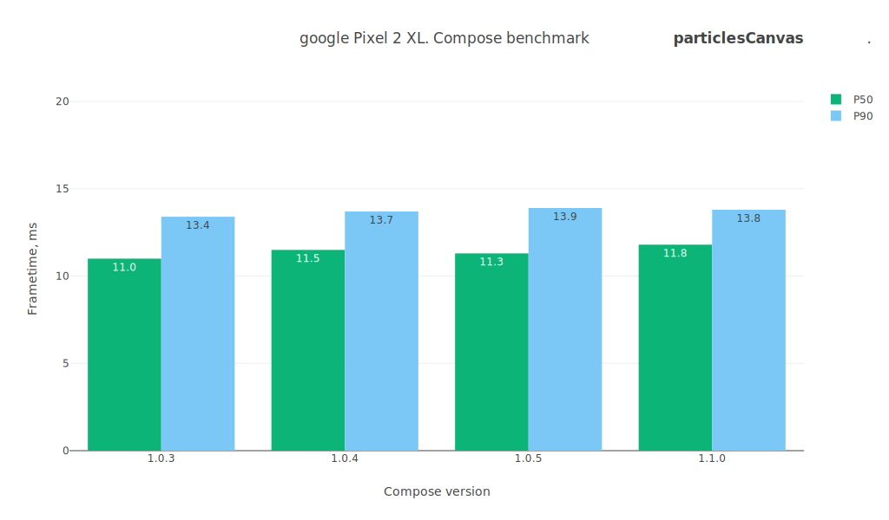
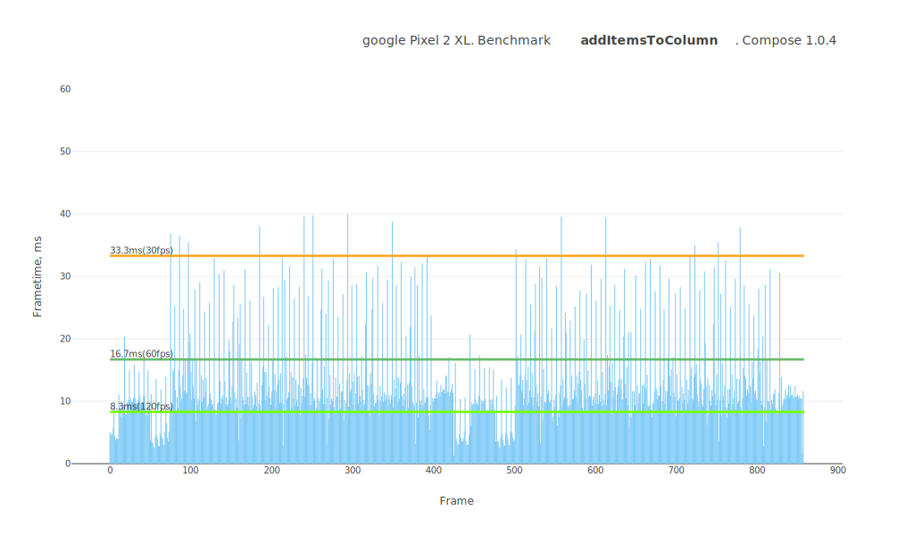
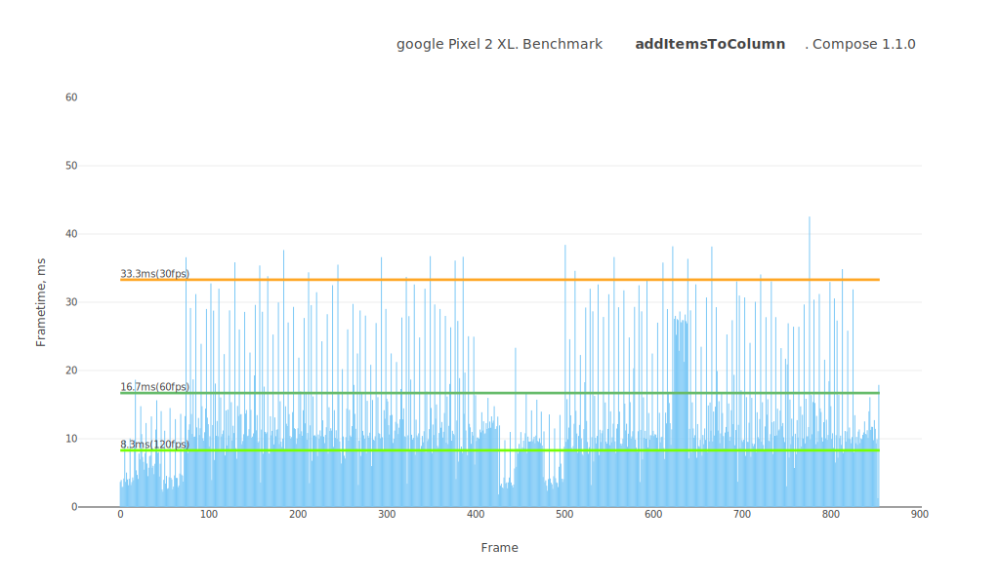
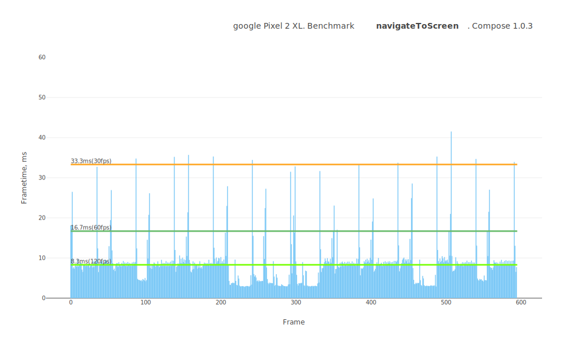

# Jetpack Compose performance test summary

## Device

**Model:** Google Pixel 2 XL

**Android API:** 30

**CPU cores:** 8

**Core clock:** 2.5Gz

**RAM:** 3.8 GB

 

# Comparison table
Test name / Compose version (P50/P90, values in ms)

Test | 1.0.3 | 1.0.4 | 1.0.5 | 1.1.0
--- | ---: | ---: | ---: | ---:
lazyListScroll | `4.8` / `7.9` | `5.1` / `8.5` | `5.1` / `8.3` | `5.1` / `7.7`
particlesCustomLayout | `12.9` / `14.8` | `13.2` / `15.2` | `13.3` / `14.7` | `13.3` / `15.2`
particlesLayoutOffset | `14.8` / `16.8` | `17.2` / `18.7` | `17.2` / `18.8` | `17.1` / `18.4`
navigateToScreen | `8.3` / `11.9` | `8.4` / `10.9` | `8.0` / `10.1` | `8.9` / `10.7`
itemRecomposition | `9.5` / `22.4` | `10.2` / `22.9` | `10.5` / `21.7` | `10.8` / `24.2`
particlesCanvas | `11.0` / `13.4` | `11.5` / `13.7` | `11.3` / `13.9` | `11.8` / `13.8`
lazyListFling | `5.2` / `8.5` | `5.3` / `8.7` | `5.3` / `8.7` | `5.4` / `8.0`
addItemsToColumn | `10.6` / `23.9` | `10.7` / `25.3` | `10.4` / `26.6` | `10.7` / `27.3`
particlesLayoutLayer | `16.0` / `18.2` | `15.3` / `19.2` | `15.4` / `19.0` | `15.6` / `18.3`
transitionAnimation | `21.4` / `27.7` | `25.1` / `28.5` | `25.4` / `29.3` | `27.0` / `30.8`
 

# lazyListScroll

Preview | Description
----- | -----
|  | This test measures the smoothness of the LazyList scrolling filled with an arbitrary layout type. It contains a lot of text, emojis, images, custom layouts, animations. The test case is as close as possible to the day-to-day applications. Relaxed scrolling of the list. |

 

# particlesCustomLayout

Preview | Description
----- | -----
|  | This test measures the performance of the custom layout system in Jetpack Compose. ⚠️ Visually, it is identical to the canvas test. Adds 500 Box layouts and moves them around, updating their positions using the Layout placing mechanism. |

 

# particlesLayoutOffset

Preview | Description
----- | -----
|  | This test measures performance of animating layout positions using the `offset` modifier in Jetpack Compose. ⚠️ Visually, it is identical to the canvas test. Adds 500 Box layouts and moves them around, updating their positions using `Modifier.offset { ... }`. |

 

# navigateToScreen

Preview | Description
----- | -----
|  | This test measures the smoothness of a standard transition between views using AnimatedNavHost. Taps on an item and routes to the details screen. |

 

# itemRecomposition

Preview | Description
----- | -----
|  | This test measures the recomposition mechanism itself. It quickly replaces items one by one. |

 

# particlesCanvas

Preview | Description
----- | -----
|  | This test measures canvas performance in Jetpack Compose. Draws 500 balls bouncing off the walls on the canvas. |

 

# lazyListFling

Preview | Description
----- | -----
|  | This test measures the smoothness of the LazyList scrolling filled with an arbitrary layout type. It contains a lot of text, emojis, images, custom layouts, animations. The test case is as close as possible to the day-to-day applications. Scrolls quickly through the list. |

 

# addItemsToColumn

Preview | Description
----- | -----
|  | This test measures the dynamic addition of items to a column.ы Adds 20 custom layouts to the Column with an animation. |

 

# particlesLayoutLayer

Preview | Description
----- | -----
|  | This test measures performance of animating layout positions using the `graphicLayer` modifier in Jetpack Compose. ⚠️ Visually, it is identical to the canvas test. Adds 500 Box layouts and moves them around, updating their positions using `Modifier.graphicLayer { ... }`. |

 

# transitionAnimation

Preview | Description
----- | -----
|  | This test measures the smoothness of transition animations on layouts. Triggers transition animations across dozens of layouts on the screen. |

 

## Benchmarks

### lazyListScroll

---
### lazyListFling

---
### transitionAnimation

---
### itemRecomposition

---
### addItemsToColumn

---
### navigateToScreen

---
### 500particlesAnimation

---
