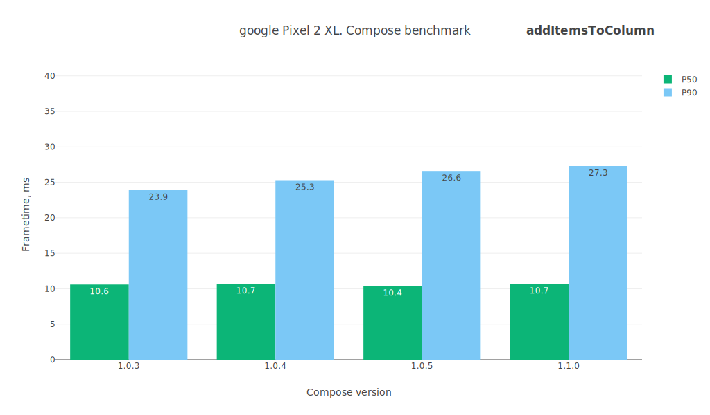
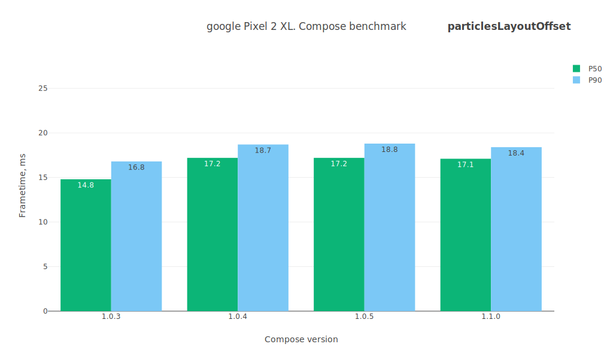
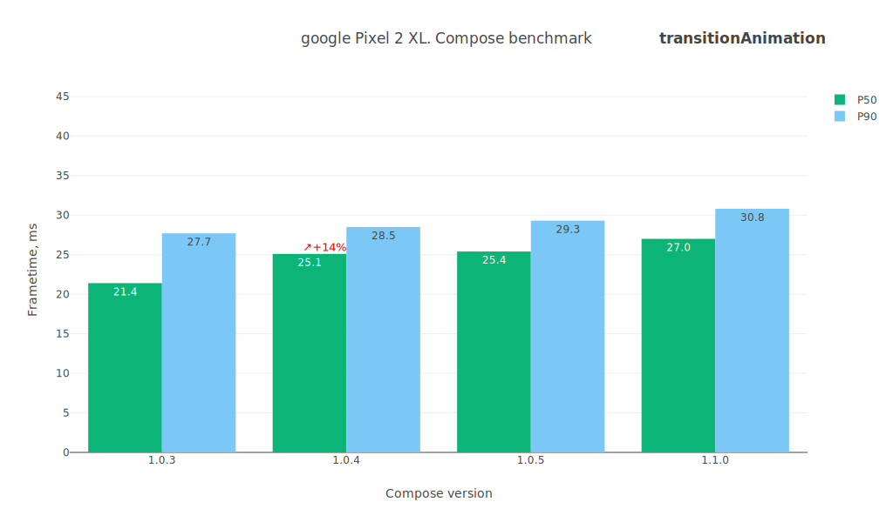
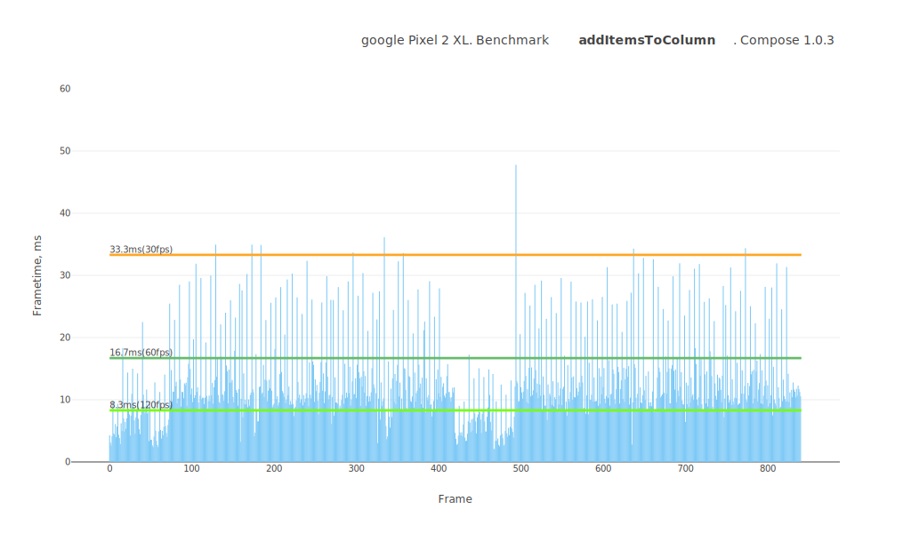
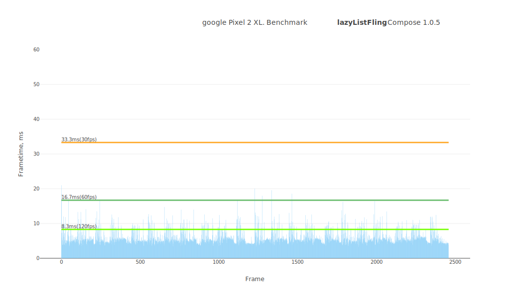
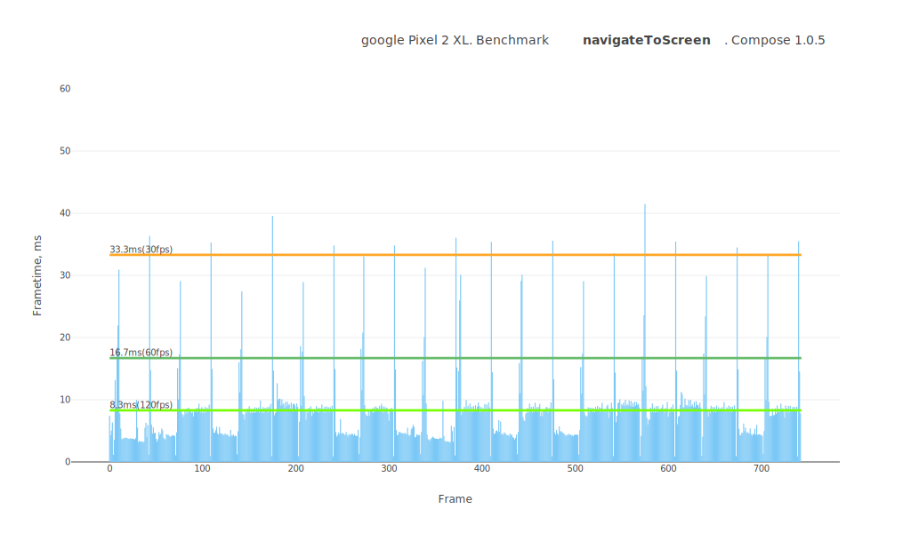
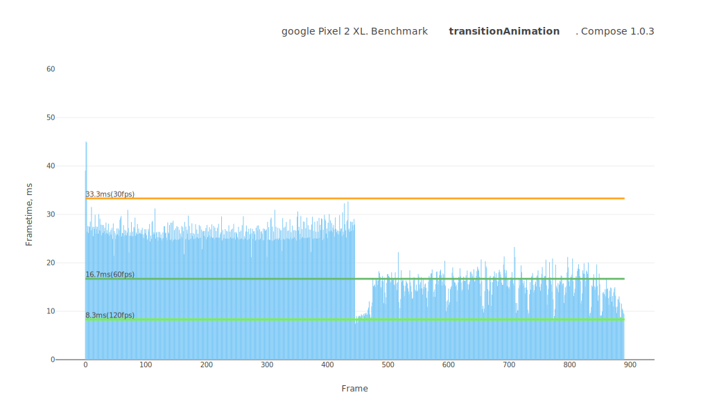
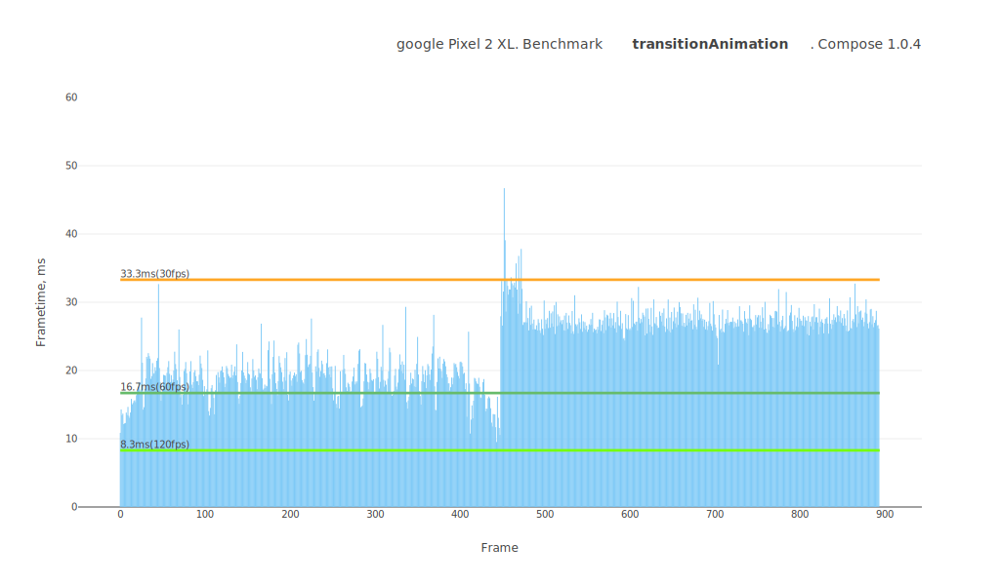

# Jetpack Compose performance test summary

## Device

**Model:** google Pixel 2 XL

**Android API:** 30

**CPU cores:** 8

**Core clock:** 2.5Gz

**RAM:** 3.8 GB

 

# Comparison table
Test name / Compose version (P50/P90, values in ms)

Test | 1.0.3 | 1.0.4 | 1.0.5 | 1.1.0-beta01 | 1.1.0-beta02
--- | ---: | ---: | ---: | ---: | ---:
addItemsToColumn | `11.3` / `24.4` | `11.3` / `27.6` | `11.2` / `26.1` | `11.0` / `25.0` | `10.9` / `25.3`
itemRecomposition | `8.3` / `23.3` | `8.3` / `24.2` | `8.4` / `23.2` | `8.3` / `22.3` | `8.2` / `23.1`
lazyListFling | `5.6` / `8.7` | `5.5` / `8.7` | `5.6` / `9.6` | `5.6` / `8.5` | `5.6` / `8.5`
lazyListScroll | `5.0` / `7.9` | `5.4` / `9.7` | `6.0` / `10.4` | `5.2` / `9.6` | `5.3` / `9.6`
navigateToScreen | `9.5` / `11.5` | `9.6` / `13.0` | `9.7` / `13.2` | `9.9` / `26.4` | `9.9` / `16.4`
particlesCanvas | `11.6` / `14.3` | `11.9` / `13.9` | `12.0` / `14.0` | `11.9` / `14.2` | `11.7` / `13.7`
particlesCustomLayout | `13.3` / `15.6` | `13.7` / `15.7` | `13.7` / `15.8` | `13.3` / `15.6` | `13.8` / `15.8`
particlesLayoutLayer | `16.4` / `18.4` | `16.5` / `18.1` | `16.2` / `17.8` | `16.4` / `18.1` | `16.3` / `17.8`
particlesLayoutOffset | `14.9` / `16.8` | `18.5` / `20.6` | `18.0` / `19.6` | `18.1` / `19.5` | `18.5` / `20.8`
transitionAnimation | `25.2` / `29.4` | `18.1` / `31.2` | `20.9` / `29.1` | `24.9` / `29.6` | `24.1` / `28.7`
 

# addItemsToColumn

Preview | Description
----- | -----
|  | This test measures the dynamic addition of items to a column.ы Adds 20 custom layouts to the Column with an animation. |

 

# itemRecomposition

Preview | Description
----- | -----
|  | This test measures the recomposition mechanism itself. It quickly replaces items one by one. |

 

# lazyListFling

Preview | Description
----- | -----
|  | This test measures the smoothness of the LazyList scrolling filled with an arbitrary layout type. It contains a lot of text, emojis, images, custom layouts, animations. The test case is as close as possible to the day-to-day applications. Scrolls quickly through the list. |

 

# lazyListScroll

Preview | Description
----- | -----
|  | This test measures the smoothness of the LazyList scrolling filled with an arbitrary layout type. It contains a lot of text, emojis, images, custom layouts, animations. The test case is as close as possible to the day-to-day applications. Relaxed scrolling of the list. |

 

# navigateToScreen

Preview | Description
----- | -----
|  | This test measures the smoothness of a standard transition between views using AnimatedNavHost. Taps on an item and routes to the details screen. |

 

# particlesCanvas

Preview | Description
----- | -----
|  | This test measures canvas performance in Jetpack Compose. Draws 500 balls bouncing off the walls on the canvas. |

 

# particlesCustomLayout

Preview | Description
----- | -----
|  | This test measures the performance of the custom layout system in Jetpack Compose. ⚠️ Visually, it is identical to the canvas test. Adds 500 Box layouts and moves them around, updating their positions using the Layout placing mechanism. |

 

# particlesLayoutLayer

Preview | Description
----- | -----
|  | This test measures performance of animating layout positions using the `graphicLayer` modifier in Jetpack Compose. ⚠️ Visually, it is identical to the canvas test. Adds 500 Box layouts and moves them around, updating their positions using `Modifier.graphicLayer { ... }`. |

 

# particlesLayoutOffset

Preview | Description
----- | -----
|  | This test measures performance of animating layout positions using the `offset` modifier in Jetpack Compose. ⚠️ Visually, it is identical to the canvas test. Adds 500 Box layouts and moves them around, updating their positions using `Modifier.offset { ... }`. |

 

# transitionAnimation

Preview | Description
----- | -----
|  | This test measures the smoothness of transition animations on layouts. Triggers transition animations across dozens of layouts on the screen. |

 

## Benchmarks

### 500particlesAnimation

---
### addItemsToColumn

---
### itemRecomposition

---
### lazyListFling

---
### lazyListScroll

---
### navigateToScreen

---
### transitionAnimation

---
