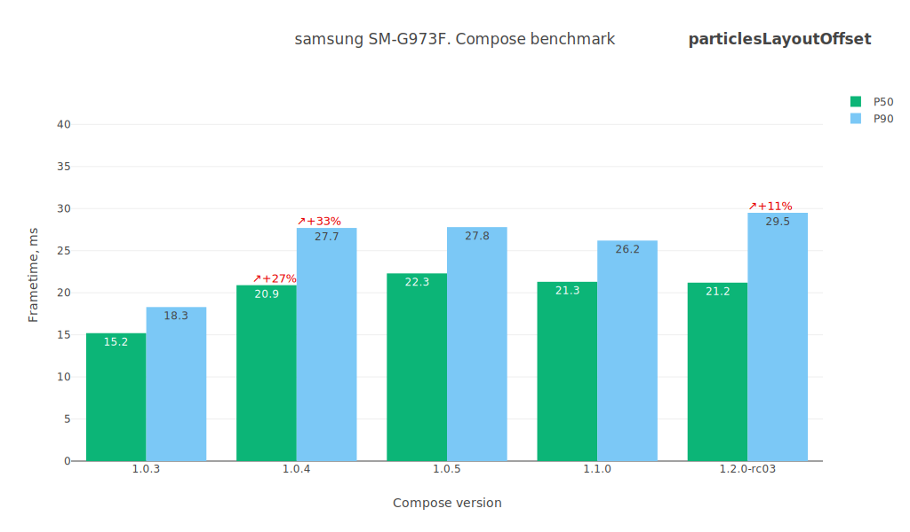
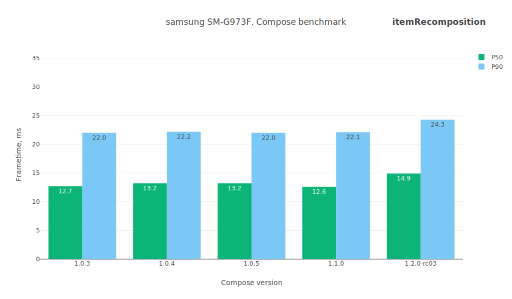
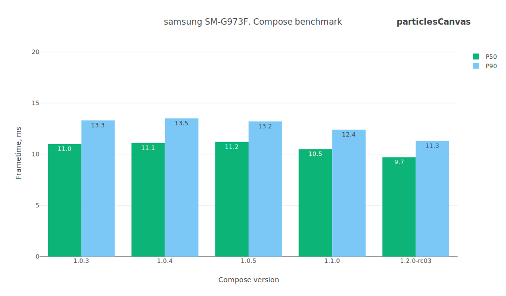
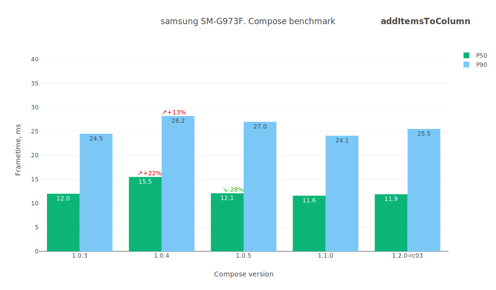
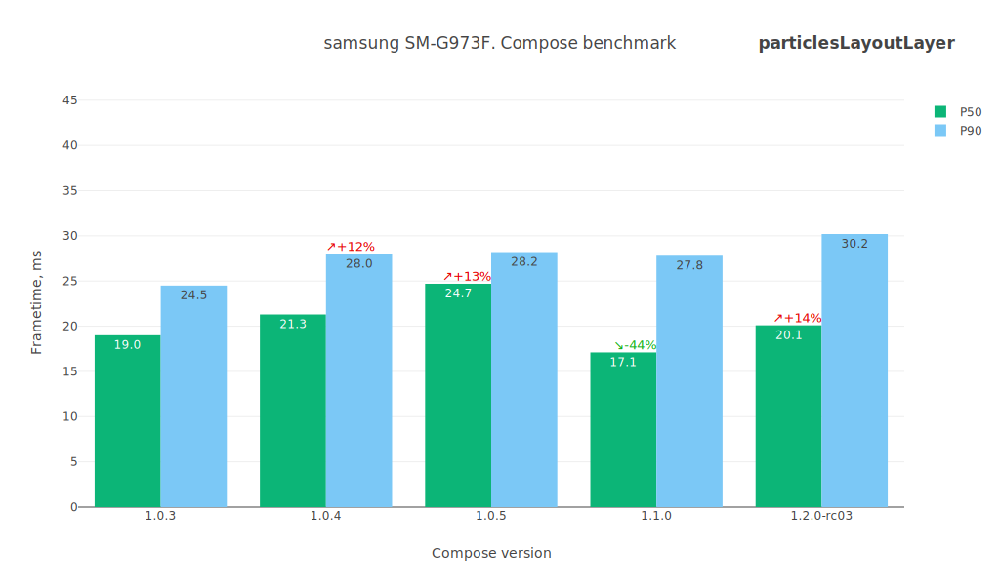
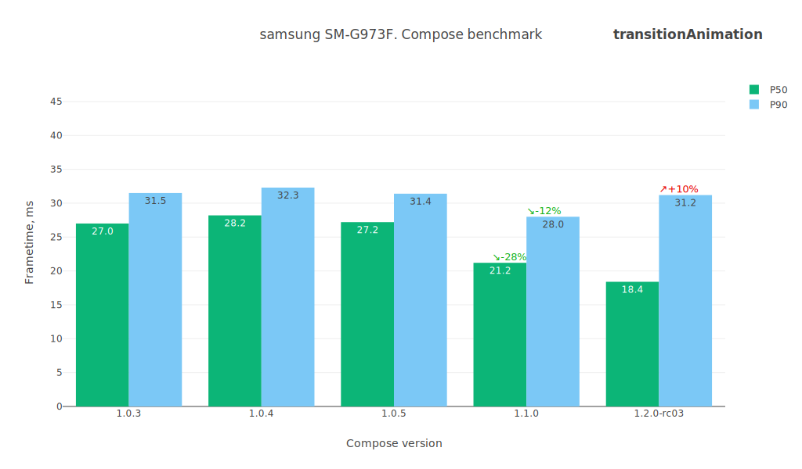
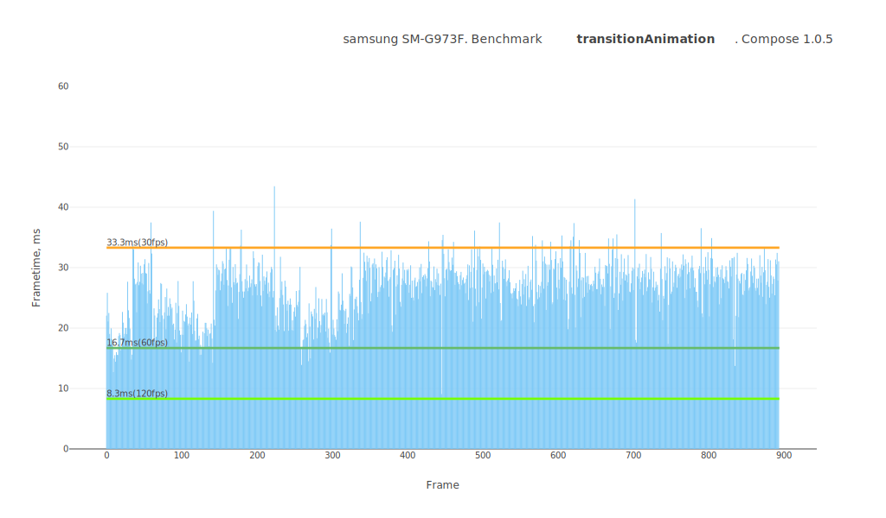
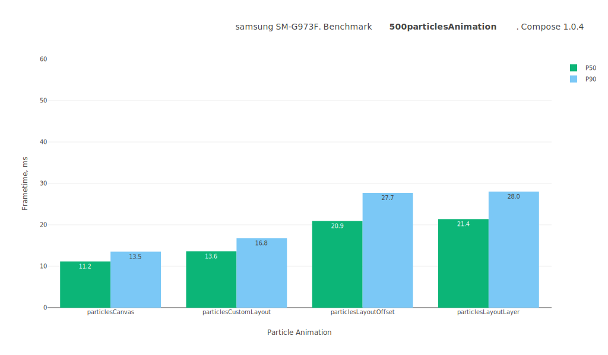
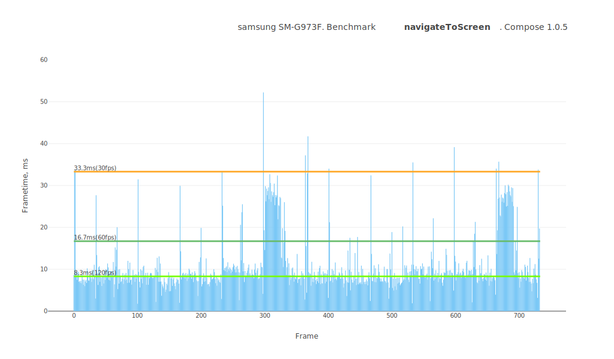
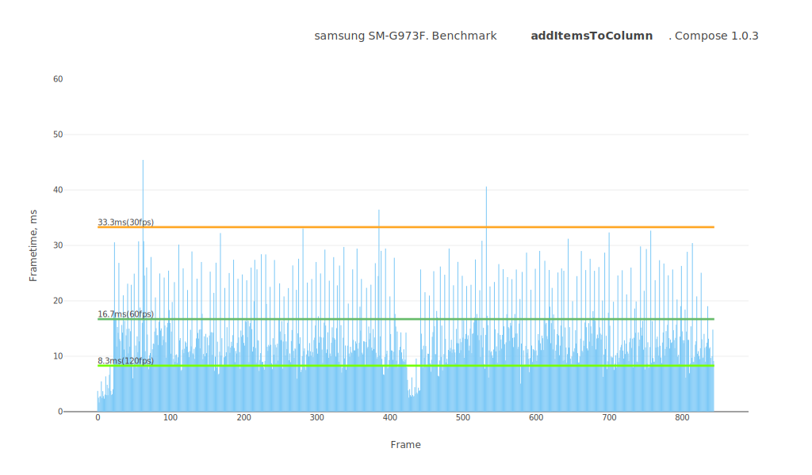

# Jetpack Compose performance test summary

## Device

**Model:** Samsung SM-G973F

**Android API:** 30

**CPU cores:** 8

**Core clock:** 2.7Gz

**RAM:** 7.8 GB

 

# Comparison table
Test name / Compose version (P50/P90, values in ms)

Test | 1.0.3 | 1.0.4 | 1.0.5 | 1.1.0-beta01 | 1.1.0-beta02 | 1.1.0-beta03 | 1.1.0-beta04
--- | ---: | ---: | ---: | ---: | ---: | ---: | ---:
lazyListScroll | `9.0` / `12.8` | `10.0` / `14.8` | `9.1` / `13.1` | `9.4` / `13.4` | `10.1` / `14.5` | `10.1` / `14.0` | `9.8` / `14.2`
particlesCustomLayout | `13.9` / `17.2` | `13.6` / `16.7` | `13.3` / `16.3` | `13.7` / `16.6` | `13.5` / `16.3` | `13.5` / `16.5` | `12.7` / `15.3`
particlesLayoutOffset | `15.2` / `18.3` | `20.9` / `27.7` | `22.3` / `27.8` | `20.4` / `26.8` | `20.7` / `27.4` | `21.2` / `27.7` | `23.5` / `27.9`
navigateToScreen | `10.0` / `28.4` | `8.3` / `20.2` | `8.6` / `21.1` | `8.9` / `26.2` | `8.3` / `11.7` | `9.0` / `27.3` | `8.4` / `22.9`
itemRecomposition | `12.7` / `22.0` | `13.2` / `22.2` | `13.2` / `22.0` | `12.9` / `22.7` | `12.9` / `22.1` | `13.0` / `23.1` | `14.4` / `24.1`
particlesCanvas | `11.0` / `13.3` | `11.1` / `13.5` | `11.2` / `13.2` | `11.0` / `13.1` | `10.8` / `12.8` | `11.1` / `13.2` | `10.6` / `12.5`
lazyListFling | `10.7` / `15.4` | `10.2` / `14.7` | `10.8` / `15.8` | `10.8` / `15.5` | `10.8` / `15.4` | `11.2` / `16.1` | `10.7` / `15.7`
addItemsToColumn | `12.0` / `24.5` | `15.5` / `28.2` | `12.1` / `27.0` | `12.1` / `26.9` | `12.6` / `27.2` | `11.1` / `25.7` | `13.9` / `27.6`
particlesLayoutLayer | `19.0` / `24.5` | `21.3` / `28.0` | `24.7` / `28.2` | `24.4` / `28.0` | `20.4` / `27.3` | `24.9` / `28.5` | `20.7` / `27.5`
transitionAnimation | `27.0` / `31.5` | `28.2` / `32.3` | `27.2` / `31.4` | `26.8` / `31.4` | `27.3` / `30.6` | `25.3` / `30.7` | `25.1` / `30.1`
 

# lazyListScroll

Preview | Description
----- | -----
|  | This test measures the smoothness of the LazyList scrolling filled with an arbitrary layout type. It contains a lot of text, emojis, images, custom layouts, animations. The test case is as close as possible to the day-to-day applications. Relaxed scrolling of the list. |

 

# particlesCustomLayout

Preview | Description
----- | -----
|  | This test measures the performance of the custom layout system in Jetpack Compose. ⚠️ Visually, it is identical to the canvas test. Adds 500 Box layouts and moves them around, updating their positions using the Layout placing mechanism. |

 

# particlesLayoutOffset

Preview | Description
----- | -----
|  | This test measures performance of animating layout positions using the `offset` modifier in Jetpack Compose. ⚠️ Visually, it is identical to the canvas test. Adds 500 Box layouts and moves them around, updating their positions using `Modifier.offset { ... }`. |

 

# navigateToScreen

Preview | Description
----- | -----
|  | This test measures the smoothness of a standard transition between views using AnimatedNavHost. Taps on an item and routes to the details screen. |

 

# itemRecomposition

Preview | Description
----- | -----
|  | This test measures the recomposition mechanism itself. It quickly replaces items one by one. |

 

# particlesCanvas

Preview | Description
----- | -----
|  | This test measures canvas performance in Jetpack Compose. Draws 500 balls bouncing off the walls on the canvas. |

 

# lazyListFling

Preview | Description
----- | -----
|  | This test measures the smoothness of the LazyList scrolling filled with an arbitrary layout type. It contains a lot of text, emojis, images, custom layouts, animations. The test case is as close as possible to the day-to-day applications. Scrolls quickly through the list. |

 

# addItemsToColumn

Preview | Description
----- | -----
|  | This test measures the dynamic addition of items to a column.ы Adds 20 custom layouts to the Column with an animation. |

 

# particlesLayoutLayer

Preview | Description
----- | -----
|  | This test measures performance of animating layout positions using the `graphicLayer` modifier in Jetpack Compose. ⚠️ Visually, it is identical to the canvas test. Adds 500 Box layouts and moves them around, updating their positions using `Modifier.graphicLayer { ... }`. |

 

# transitionAnimation

Preview | Description
----- | -----
|  | This test measures the smoothness of transition animations on layouts. Triggers transition animations across dozens of layouts on the screen. |

 

## Benchmarks

### transitionAnimation

---
### lazyListScroll

---
### 500particlesAnimation

---
### lazyListFling

---
### navigateToScreen

---
### itemRecomposition

---
### addItemsToColumn

---
