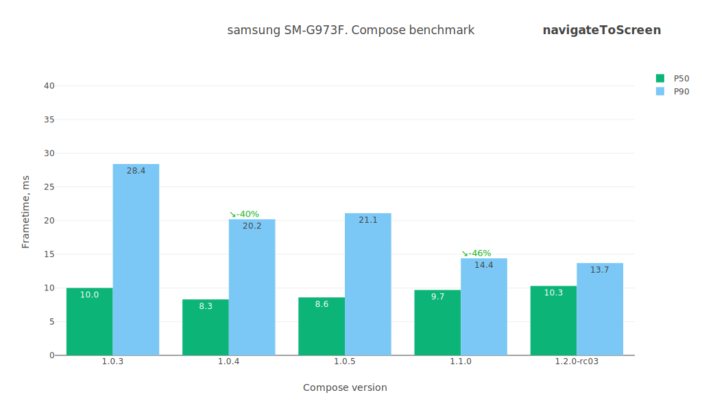
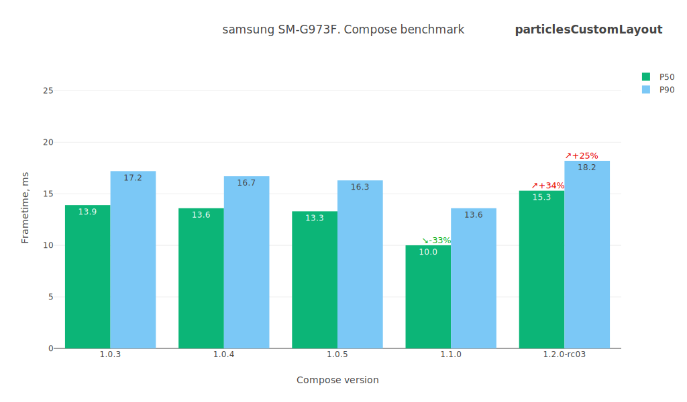
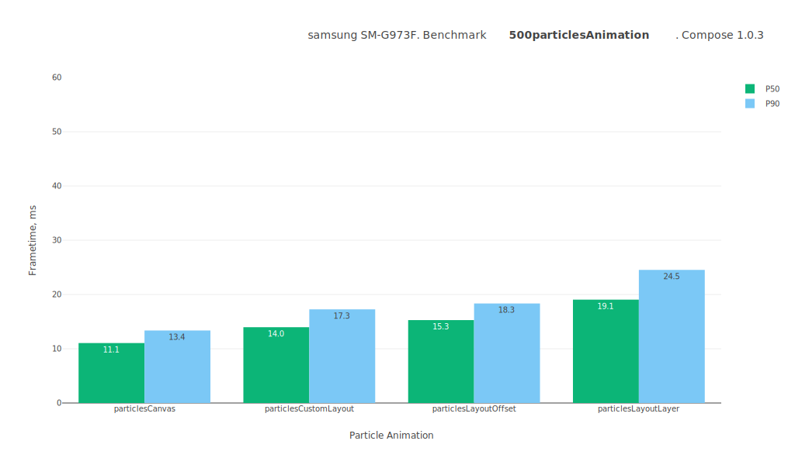
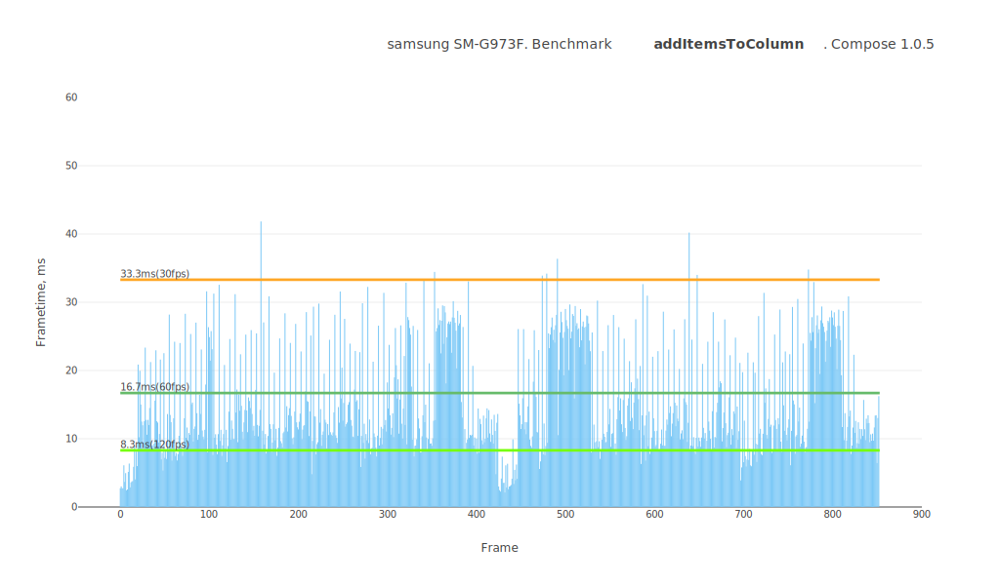
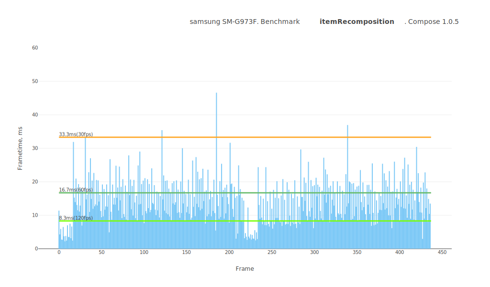

# Jetpack Compose performance test summary

## Device

**Model:** samsung SM-G973F

**Android API:** 30

**CPU cores:** 8

**Core clock:** 2.7Gz

**RAM:** 7.8 GB

 

# Comparison table
Test name / Compose version (P50/P90, values in ms)

Test | 1.0.3 | 1.0.4 | 1.0.5 | 1.1.0-beta01 | 1.1.0-beta02
--- | ---: | ---: | ---: | ---: | ---:
addItemsToColumn | `7.9` / `17.2` | `12.2` / `27.5` | `13.0` / `27.8` | `13.0` / `27.5` | `12.3` / `26.8`
itemRecomposition | `9.1` / `18.5` | `10.7` / `23.6` | `10.7` / `23.6` | `11.4` / `23.4` | `10.7` / `22.7`
lazyListFling | `10.5` / `14.8` | `10.4` / `14.9` | `10.5` / `15.3` | `10.6` / `14.9` | `10.6` / `15.1`
lazyListScroll | `7.2` / `10.3` | `9.5` / `13.3` | `9.9` / `13.8` | `9.6` / `13.4` | `9.5` / `13.6`
navigateToScreen | `6.3` / `12.5` | `9.3` / `27.0` | `9.6` / `25.7` | `9.7` / `28.1` | `10.5` / `27.8`
particlesCanvas | `11.2` / `13.2` | `11.2` / `13.0` | `11.0` / `13.1` | `11.2` / `13.5` | `11.3` / `13.3`
particlesCustomLayout | `11.4` / `15.1` | `14.4` / `26.1` | `13.9` / `16.9` | `13.9` / `16.8` | `13.5` / `16.5`
particlesLayoutLayer | `17.8` / `25.4` | `21.0` / `27.6` | `20.6` / `25.7` | `22.7` / `28.5` | `22.8` / `28.3`
particlesLayoutOffset | `15.1` / `17.9` | `21.4` / `27.6` | `25.2` / `28.5` | `21.3` / `27.4` | `21.8` / `27.6`
transitionAnimation | `26.5` / `31.6` | `28.7` / `33.0` | `28.0` / `32.1` | `28.2` / `31.7` | `27.6` / `31.2`
 

# addItemsToColumn

Preview | Description
----- | -----
|  | This test measures the dynamic addition of items to a column.ы Adds 20 custom layouts to the Column with an animation. |

 

# itemRecomposition

Preview | Description
----- | -----
|  | This test measures the recomposition mechanism itself. It quickly replaces items one by one. |

 

# lazyListFling

Preview | Description
----- | -----
|  | This test measures the smoothness of the LazyList scrolling filled with an arbitrary layout type. It contains a lot of text, emojis, images, custom layouts, animations. The test case is as close as possible to the day-to-day applications. Scrolls quickly through the list. |

 

# lazyListScroll

Preview | Description
----- | -----
|  | This test measures the smoothness of the LazyList scrolling filled with an arbitrary layout type. It contains a lot of text, emojis, images, custom layouts, animations. The test case is as close as possible to the day-to-day applications. Relaxed scrolling of the list. |

 

# navigateToScreen

Preview | Description
----- | -----
|  | This test measures the smoothness of a standard transition between views using AnimatedNavHost. Taps on an item and routes to the details screen. |

 

# particlesCanvas

Preview | Description
----- | -----
|  | This test measures canvas performance in Jetpack Compose. Draws 500 balls bouncing off the walls on the canvas. |

 

# particlesCustomLayout

Preview | Description
----- | -----
|  | This test measures the performance of the custom layout system in Jetpack Compose. ⚠️ Visually, it is identical to the canvas test. Adds 500 Box layouts and moves them around, updating their positions using the Layout placing mechanism. |

 

# particlesLayoutLayer

Preview | Description
----- | -----
|  | This test measures performance of animating layout positions using the `graphicLayer` modifier in Jetpack Compose. ⚠️ Visually, it is identical to the canvas test. Adds 500 Box layouts and moves them around, updating their positions using `Modifier.graphicLayer { ... }`. |

 

# particlesLayoutOffset

Preview | Description
----- | -----
|  | This test measures performance of animating layout positions using the `offset` modifier in Jetpack Compose. ⚠️ Visually, it is identical to the canvas test. Adds 500 Box layouts and moves them around, updating their positions using `Modifier.offset { ... }`. |

 

# transitionAnimation

Preview | Description
----- | -----
|  | This test measures the smoothness of transition animations on layouts. Triggers transition animations across dozens of layouts on the screen. |

 

## Benchmarks

### 500particlesAnimation

---
### addItemsToColumn

---
### itemRecomposition

---
### lazyListFling

---
### lazyListScroll

---
### navigateToScreen

---
### transitionAnimation

---
