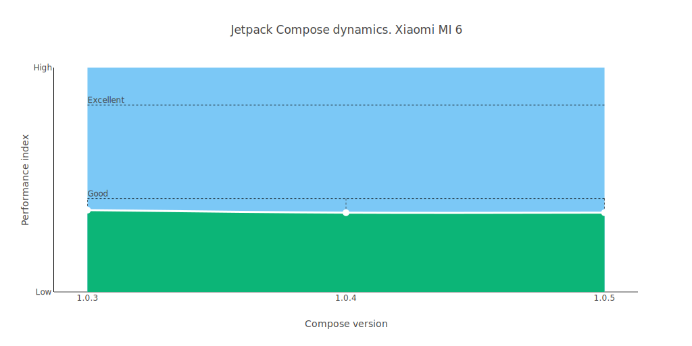
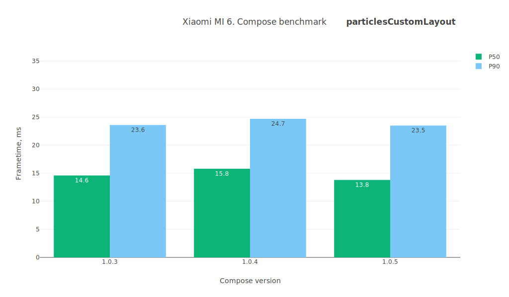
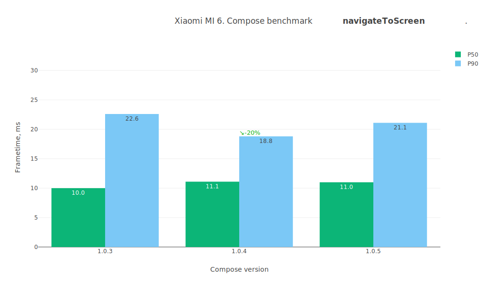
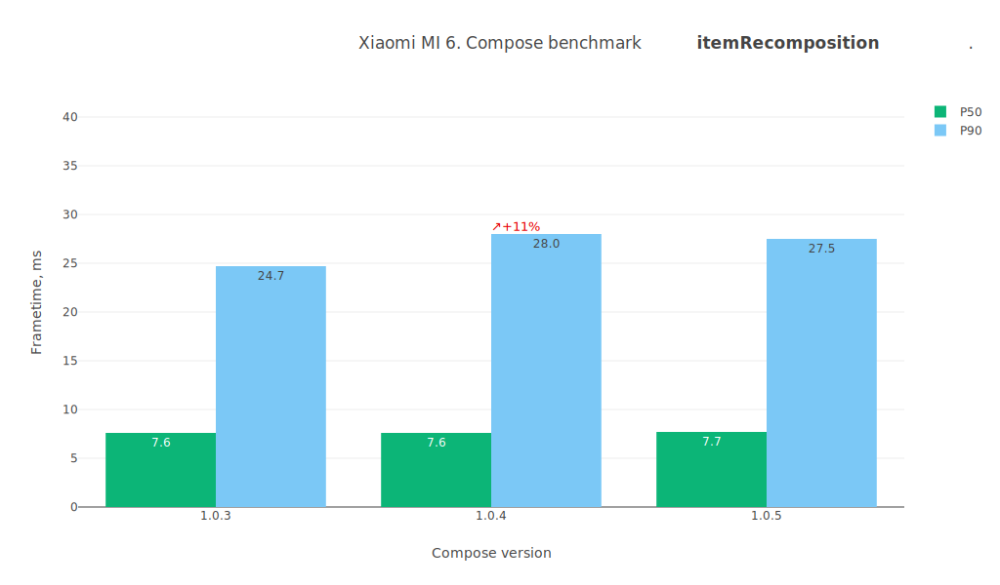
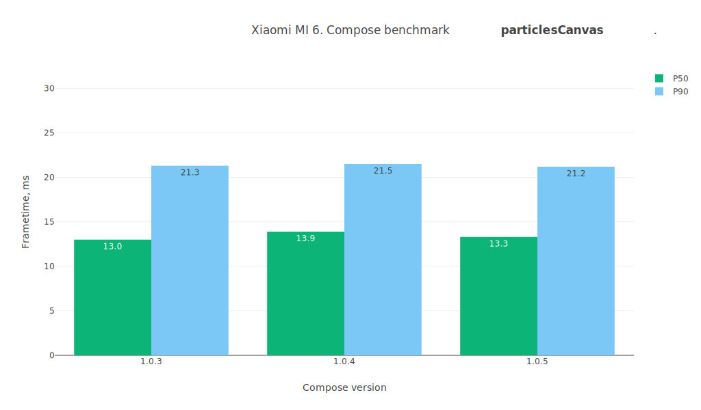
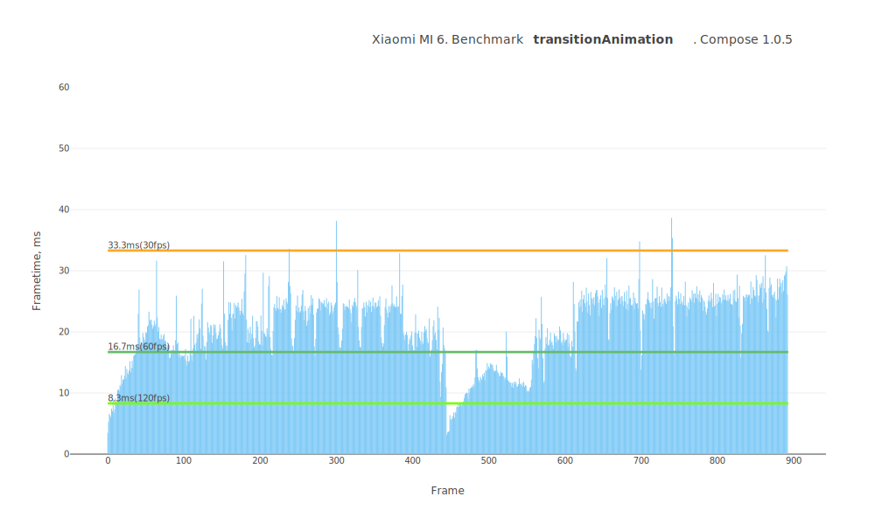
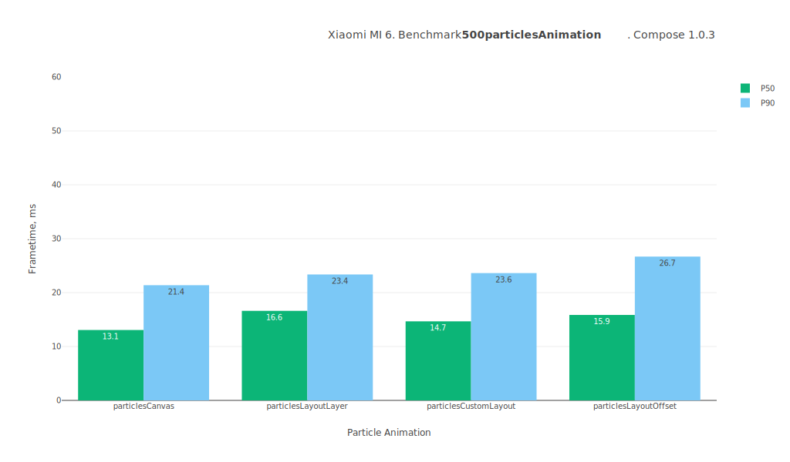
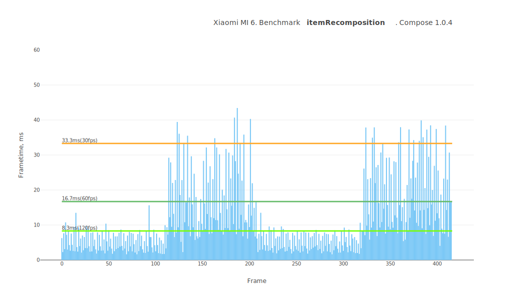
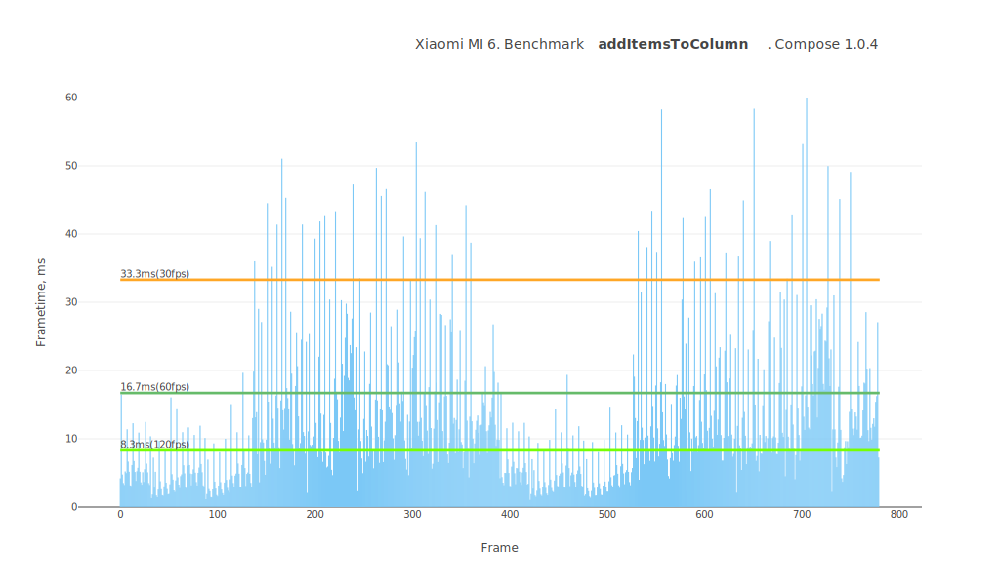

# Jetpack Compose performance test summary

## Device

**Model:** Xiaomi MI 6

**Android API:** 28

**CPU cores:** 8

**Core clock:** 2.5Gz

**RAM:** 6.0 GB

 

# Comparison table
Test name / Compose version (P50/P90, values in ms)

Test | 1.0.3 | 1.0.4 | 1.0.5 | 1.1.0-beta01 | 1.1.0-beta02 | 1.1.0-beta03 | 1.1.0-beta04
--- | ---: | ---: | ---: | ---: | ---: | ---: | ---:
lazyListScroll | `13.0` / `20.2` | `13.1` / `21.9` | `13.4` / `21.6` | `13.7` / `23.9` | `15.1` / `29.0` | `13.5` / `24.0` | `14.2` / `27.6`
particlesCustomLayout | `14.6` / `23.6` | `15.8` / `24.7` | `13.8` / `23.5` | `12.6` / `21.9` | `14.7` / `23.7` | `13.2` / `23.9` | `12.2` / `20.9`
particlesLayoutOffset | `15.8` / `26.6` | `17.6` / `21.9` | `18.9` / `22.6` | `18.7` / `22.5` | `18.3` / `23.2` | `17.5` / `21.6` | `17.6` / `22.0`
navigateToScreen | `10.0` / `22.6` | `11.1` / `18.8` | `11.0` / `21.1` | `11.9` / `20.1` | `11.5` / `25.0` | `11.4` / `23.8` | `11.5` / `27.4`
itemRecomposition | `7.6` / `24.7` | `7.6` / `28.0` | `7.7` / `27.5` | `7.7` / `25.5` | `7.5` / `26.0` | `7.5` / `27.7` | `7.8` / `24.8`
particlesCanvas | `13.0` / `21.3` | `13.9` / `21.5` | `13.3` / `21.2` | `13.3` / `22.1` | `13.3` / `21.5` | `13.3` / `21.6` | `13.0` / `21.2`
lazyListFling | `14.0` / `22.8` | `13.7` / `23.5` | `13.6` / `22.8` | `14.0` / `25.4` | `14.5` / `27.1` | `13.9` / `25.3` | `14.1` / `25.8`
addItemsToColumn | `9.6` / `26.2` | `9.7` / `26.6` | `9.6` / `24.4` | `9.0` / `25.0` | `9.5` / `25.9` | `9.3` / `24.5` | `9.7` / `26.3`
particlesLayoutLayer | `16.6` / `23.3` | `18.6` / `22.6` | `18.7` / `23.4` | `18.6` / `22.6` | `18.5` / `22.6` | `18.4` / `22.2` | `18.4` / `22.2`
transitionAnimation | `17.7` / `21.2` | `19.7` / `25.9` | `22.0` / `26.2` | `17.5` / `21.8` | `21.1` / `26.8` | `18.1` / `23.6` | `19.7` / `26.1`
 

# lazyListScroll

Preview | Description
----- | -----
|  | This test measures the smoothness of the LazyList scrolling filled with an arbitrary layout type. It contains a lot of text, emojis, images, custom layouts, animations. The test case is as close as possible to the day-to-day applications. Relaxed scrolling of the list. |

 

# particlesCustomLayout

Preview | Description
----- | -----
|  | This test measures the performance of the custom layout system in Jetpack Compose. ⚠️ Visually, it is identical to the canvas test. Adds 500 Box layouts and moves them around, updating their positions using the Layout placing mechanism. |

 

# particlesLayoutOffset

Preview | Description
----- | -----
|  | This test measures performance of animating layout positions using the `offset` modifier in Jetpack Compose. ⚠️ Visually, it is identical to the canvas test. Adds 500 Box layouts and moves them around, updating their positions using `Modifier.offset { ... }`. |

 

# navigateToScreen

Preview | Description
----- | -----
|  | This test measures the smoothness of a standard transition between views using AnimatedNavHost. Taps on an item and routes to the details screen. |

 

# itemRecomposition

Preview | Description
----- | -----
|  | This test measures the recomposition mechanism itself. It quickly replaces items one by one. |

 

# particlesCanvas

Preview | Description
----- | -----
|  | This test measures canvas performance in Jetpack Compose. Draws 500 balls bouncing off the walls on the canvas. |

 

# lazyListFling

Preview | Description
----- | -----
|  | This test measures the smoothness of the LazyList scrolling filled with an arbitrary layout type. It contains a lot of text, emojis, images, custom layouts, animations. The test case is as close as possible to the day-to-day applications. Scrolls quickly through the list. |

 

# addItemsToColumn

Preview | Description
----- | -----
|  | This test measures the dynamic addition of items to a column.ы Adds 20 custom layouts to the Column with an animation. |

 

# particlesLayoutLayer

Preview | Description
----- | -----
|  | This test measures performance of animating layout positions using the `graphicLayer` modifier in Jetpack Compose. ⚠️ Visually, it is identical to the canvas test. Adds 500 Box layouts and moves them around, updating their positions using `Modifier.graphicLayer { ... }`. |

 

# transitionAnimation

Preview | Description
----- | -----
|  | This test measures the smoothness of transition animations on layouts. Triggers transition animations across dozens of layouts on the screen. |

 

## Benchmarks

### transitionAnimation

---
### lazyListScroll

---
### 500particlesAnimation

---
### lazyListFling

---
### navigateToScreen

---
### itemRecomposition

---
### addItemsToColumn

---
