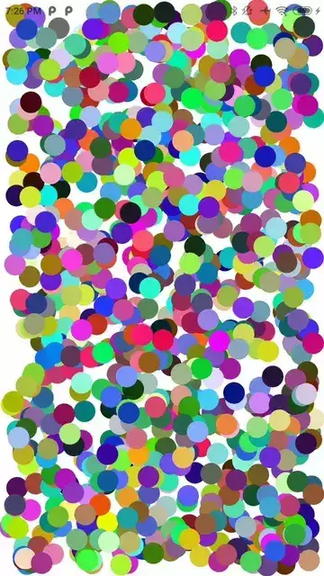
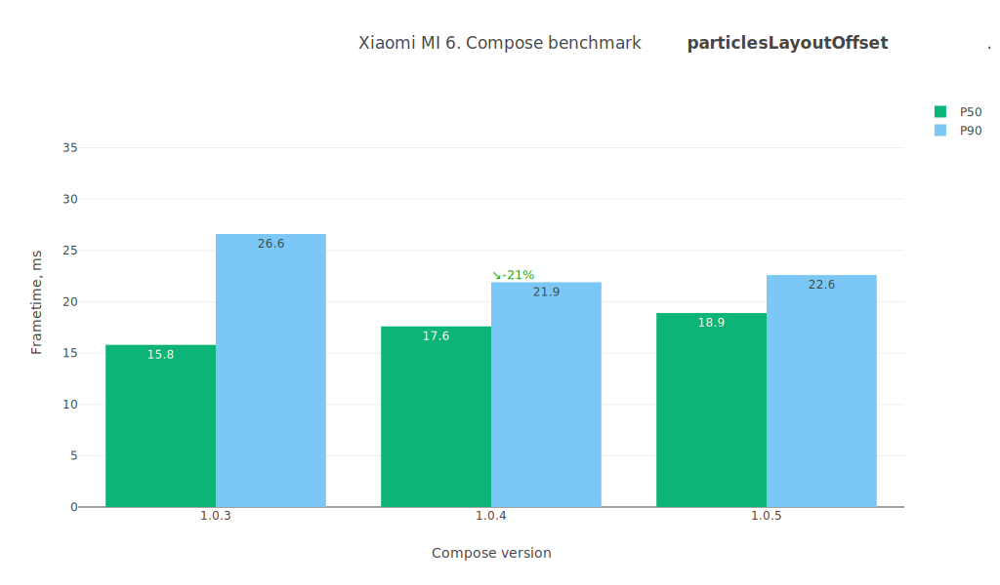
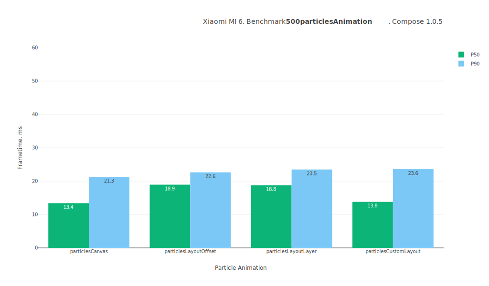

# Jetpack Compose performance test summary

## Device

**Model:** Xiaomi MI 6

**Android API:** 28

**CPU cores:** 8

**Core clock:** 2.5Gz

**RAM:** 6.0 GB

 

# Comparison table
Test name / Compose version (P50/P90, values in ms)

Test | 1.0.3 | 1.0.4 | 1.0.5 | 1.1.0-beta01 | 1.1.0-beta02
--- | ---: | ---: | ---: | ---: | ---:
addItemsToColumn | `13.0` / `35.2` | `12.8` / `38.2` | `11.4` / `31.4` | `10.9` / `30.0` | `10.8` / `29.6`
itemRecomposition | `10.4` / `25.6` | `10.0` / `26.4` | `9.2` / `19.7` | `9.1` / `21.3` | `9.0` / `20.3`
lazyListFling | `16.0` / `29.6` | `16.0` / `27.9` | `12.7` / `26.8` | `12.9` / `25.7` | `12.5` / `25.1`
lazyListScroll | `14.4` / `28.3` | `15.1` / `23.5` | `12.8` / `21.0` | `12.8` / `21.2` | `12.6` / `20.3`
navigateToScreen | `13.1` / `31.2` | `13.7` / `31.3` | `11.9` / `27.9` | `12.0` / `27.4` | `12.0` / `27.3`
particlesCanvas | `17.7` / `23.4` | `18.6` / `24.3` | `15.4` / `21.8` | `15.0` / `21.4` | `15.3` / `21.8`
particlesCustomLayout | `18.2` / `24.9` | `17.0` / `25.6` | `16.8` / `24.4` | `16.4` / `24.3` | `15.3` / `23.0`
particlesLayoutLayer | `18.5` / `24.5` | `20.6` / `24.4` | `18.4` / `22.9` | `18.7` / `23.0` | `19.6` / `23.2`
particlesLayoutOffset | `19.8` / `37.1` | `21.4` / `23.7` | `18.1` / `21.4` | `18.7` / `22.2` | `19.8` / `22.8`
transitionAnimation | `21.3` / `26.8` | `20.7` / `26.7` | `20.0` / `26.8` | `20.3` / `25.7` | `18.8` / `25.9`
 

# addItemsToColumn

Preview | Description
----- | -----
|  | This test measures the dynamic addition of items to a column.ы Adds 20 custom layouts to the Column with an animation. |

 

# itemRecomposition

Preview | Description
----- | -----
|  | This test measures the recomposition mechanism itself. It quickly replaces items one by one. |

 

# lazyListFling

Preview | Description
----- | -----
|  | This test measures the smoothness of the LazyList scrolling filled with an arbitrary layout type. It contains a lot of text, emojis, images, custom layouts, animations. The test case is as close as possible to the day-to-day applications. Scrolls quickly through the list. |

 

# lazyListScroll

Preview | Description
----- | -----
|  | This test measures the smoothness of the LazyList scrolling filled with an arbitrary layout type. It contains a lot of text, emojis, images, custom layouts, animations. The test case is as close as possible to the day-to-day applications. Relaxed scrolling of the list. |

 

# navigateToScreen

Preview | Description
----- | -----
|  | This test measures the smoothness of a standard transition between views using AnimatedNavHost. Taps on an item and routes to the details screen. |

 

# particlesCanvas

Preview | Description
----- | -----
|  | This test measures canvas performance in Jetpack Compose. Draws 500 balls bouncing off the walls on the canvas. |

 

# particlesCustomLayout

Preview | Description
----- | -----
|  | This test measures the performance of the custom layout system in Jetpack Compose. ⚠️ Visually, it is identical to the canvas test. Adds 500 Box layouts and moves them around, updating their positions using the Layout placing mechanism. |

 

# particlesLayoutLayer

Preview | Description
----- | -----
|  | This test measures performance of animating layout positions using the `graphicLayer` modifier in Jetpack Compose. ⚠️ Visually, it is identical to the canvas test. Adds 500 Box layouts and moves them around, updating their positions using `Modifier.graphicLayer { ... }`. |

 

# particlesLayoutOffset

Preview | Description
----- | -----
|  | This test measures performance of animating layout positions using the `offset` modifier in Jetpack Compose. ⚠️ Visually, it is identical to the canvas test. Adds 500 Box layouts and moves them around, updating their positions using `Modifier.offset { ... }`. |

 

# transitionAnimation

Preview | Description
----- | -----
|  | This test measures the smoothness of transition animations on layouts. Triggers transition animations across dozens of layouts on the screen. |

 

## Benchmarks

### 500particlesAnimation

---
### addItemsToColumn

---
### itemRecomposition

---
### lazyListFling

---
### lazyListScroll

---
### navigateToScreen

---
### transitionAnimation

---
